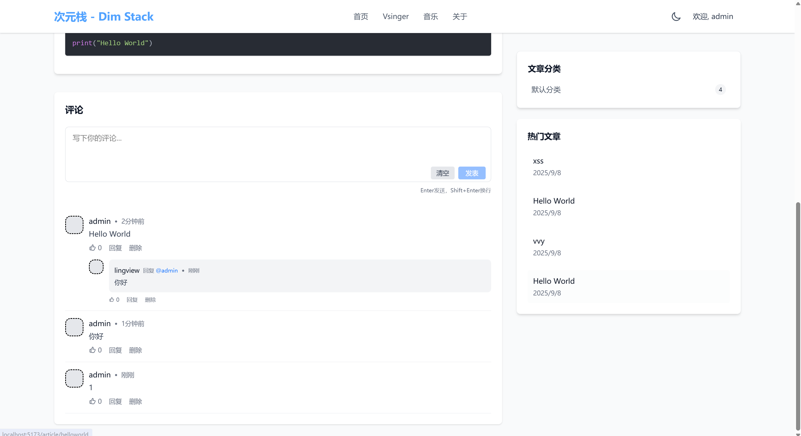

# 次元栈论坛 · Dim Stack
> 一个为虚拟歌手（Vsinger）、Minecraft 玩家与计算机爱好者打造的多元兴趣内容社区  
基于 Spring Boot + React 的现代化论坛 CMS 系统
>

  
  
  
  


---

## 🌟 项目简介
**次元栈** 是一个面向多元兴趣群体的内容社区平台，致力于为 **Vsinger 爱好者**、**Minecraft 创作者** 与 **计算机技术爱好者** 提供一个自由表达、知识共享与创作沉淀的空间。

平台核心功能：

+ 📝 文章发布与内容管理（CMS）
+ 💬 用户互动：评论、点赞、收藏
+ 🔖 标签分类：支持跨圈层内容组织（如 #洛天依、#乐正绫、#星尘、#红石电路、#Java）
+ 👥 用户系统：注册、登录、个人主页
+ 🔍 内容搜索与推荐
+ 📱 响应式前端，支持移动端浏览

---

## 🛠 技术栈
| 层级 | 技术选型 |
| --- | --- |
| **后端** | Java 17, Spring Boot 3.5, Mybatis, MySQL, Redis, Cookie |
| **前端** | React 19, JavaScript, Vite, Axios, Tailwind CSS |
| **构建** | Maven (后端), npm/pnpm (前端) |
| **部署** | Docker, Nginx, Linux, Windows |


---


## 部署文档
> 环境要求（给出版本为可用版本，其他版本请自行测试）
>
> OpenJDK版本：17+
>
> Redis版本：5+
>
> mysql版本：8+
>
> 演示站：[https://apilinks.cn/](https://apilinks.cn/)
>
> 用户名：admin
>
> 密码：123456
>


注：系统默认账号为admin，密码123456，部署完成后需手动到后台修改

### 1、创建配置文件（application.yml）
> 将Mysql以及Redis密码改为自己的，可以适当修改日志级别
>
> 将配置文件放到jar包同级目录下的config文件夹
>

```yaml
spring:
  jackson:
    time-zone: GMT+8
    date-format: yyyy-MM-dd HH:mm:ss

  session:
    redis:
      namespace: "dimstack:session"
      flush-mode: on_save
      save-mode: always

  datasource:
    url: jdbc:mysql://localhost:3306/dim_stack?characterEncoding=utf-8&nullCatalogMeansCurrent=true&serverTimezone=GMT%2B8&useSSL=false&allowPublicKeyRetrieval=true&useAffectedRows=true
    driver-class-name: com.mysql.cj.jdbc.Driver
    username: root
    password: ""
    hikari:
      maximum-pool-size: 20
      minimum-idle: 5
      connection-timeout: 30000
      idle-timeout: 600000
      max-lifetime: 1800000

  servlet:
    multipart:
      enabled: true
      max-file-size: 1000000MB
      max-request-size: 200000MB

  data:
    redis:
      host: 127.0.0.1
      port: 6379
      password: ""
      timeout: 5s
      lettuce:
        pool:
          max-active: 8
          max-idle: 8
          min-idle: 0
          max-wait: -1ms

  devtools:
    restart:
      enabled: false
    livereload:
      enabled: false


  thymeleaf:
    cache: true
    enabled: true
    prefix: classpath:/templates/
    suffix: .html
    encoding: UTF-8
    servlet:
      content-type: text/html

  profiles:
    active: dev

springdoc:
  api-docs:
    enabled: false
    path: /v3/api-docs
  swagger-ui:
    enabled: false
    path: /swagger-ui/index.html
    cors:
      enabled: false

project:
  version: ${project.version}
  build-date: ${maven.build.timestamp}

management:
  endpoints:
    enabled-by-default: false
    web:
      exposure:
        include: health,info
  endpoint:
    health:
      enabled: true
      show-details: when-authorized
    info:
      enabled: true
    metrics:
      enabled: false
    shutdown:
      enabled: false

mybatis:
  type-aliases-package: xyz.lingview.dimstack.**.domain
  mapper-locations: classpath*:mapper/*Mapper.xml
  config-location: classpath:mybatis-config.xml

server:
  port: 2222
  servlet:
    context-path: /
  tomcat:
    uri-encoding: UTF-8
    max-threads: 200
    min-spare-threads: 10
    protocol-header: X-Forwarded-Proto
    remote-ip-header: X-Forwarded-For


  forward-headers-strategy: native

logging:
  level:
    xyz.lingview.dimstack: debug
    org.springframework: warn
    org.springframework.security: info
    org.springframework.session: debug
    org.springframework.web: debug

file:
  upload-dir: upload
```

### 2.Nginx反向代理配置文件
```bash
server {
    listen 80;
    listen 443 ssl;
    listen 443 quic;
    http2 on;
    server_name www.apilinks.cn apilinks.cn;


    # CERT-APPLY-CHECK--START
    include /www/server/panel/vhost/nginx/well-known/dimstack.conf;
    # CERT-APPLY-CHECK--END

    # HTTP_TO_HTTPS_START
    set $isRedcert 1;
    if ($server_port != 443) {
        set $isRedcert 2;
    }
    if ( $uri ~ /\.well-known/ ) {
        set $isRedcert 1;
    }
    if ($isRedcert != 1) {
        return 301 https://$host$request_uri;
    }
    # HTTP_TO_HTTPS_END

    # SSL 配置（保持不变）
    ssl_certificate    /www/server/panel/vhost/cert/dimstack/fullchain.pem;
    ssl_certificate_key    /www/server/panel/vhost/cert/dimstack/privkey.pem;
    ssl_protocols TLSv1.1 TLSv1.2 TLSv1.3;
    ssl_ciphers EECDH+CHACHA20:EECDH+CHACHA20-draft:EECDH+AES128:RSA+AES128:EECDH+AES256:RSA+AES256:EECDH+3DES:RSA+3DES:!MD5;
    ssl_prefer_server_ciphers on;
    ssl_session_tickets on;
    ssl_session_cache shared:SSL:10m;
    ssl_session_timeout 10m;
    add_header Strict-Transport-Security "max-age=31536000" always;
    add_header Alt-Svc 'quic=":443"; h3=":443"; h3-29=":443"; h3-27=":443";h3-25=":443"; h3-T050=":443"; h3-Q050=":443";h3-Q049=":443";h3-Q048=":443"; h3-Q046=":443"; h3-Q043=":443"' always;
    error_page 497  https://$host$request_uri;


    location / {
        proxy_pass http://127.0.0.1:2222;
        proxy_set_header Host $host;
        proxy_set_header X-Real-IP $remote_addr;
        proxy_set_header X-Forwarded-For $proxy_add_x_forwarded_for;
        proxy_set_header X-Forwarded-Proto $scheme;
        proxy_set_header X-Forwarded-Host $host;
        proxy_set_header X-Forwarded-Port $server_port;
        proxy_http_version 1.1;
        proxy_set_header Upgrade $http_upgrade;
        proxy_set_header Connection "upgrade";

        proxy_connect_timeout 30s;
        proxy_read_timeout 86400s;
        proxy_send_timeout 30s;
    }

    # 日志
    access_log  /www/wwwlogs/dimstack.log;
    error_log   /www/wwwlogs/dimstack.error.log;
}
```

### 2.创建数据库并导入数据
> dim_stack.sql这个文件导入创建的数据库
>

### 3.启动系统
```yaml
java -jar dim_stack.jar
```


## 主要界面展示
### 前台
> 白天模式  

>

> 夜晚模式  

>

> 密码文章  

>

> 文章阅读器  

>

> 评论区  

>


> 文章搜索
>

### 后台
> 控制台主页
>
> 
>

> 个人中心
>
> 
>

> 用户管理
>
> 
>
> 
>

> 文章管理
>
> 
>
> 
>
> 
>

> 文章审核
>
> 
>
> 
>

> 评论管理
>
> 
>

> 标签&分类管理
>
> 
>
> 
>

> 菜单编辑
>
> 
>

> 站点信息设置
>
> 
>


## 致谢
在此，我们衷心感谢以下为本项目提供帮助、支持或灵感的个人和组织：

### 贡献者
感谢所有参与本项目的贡献者（按字母顺序排列）：

+ [@bytegeek](https://github.com/xrb114) - 渗透测试
+ [@lingview](https://github.com/lingview) - 系统开发
+ [@q1uf3ng](https://github.com/q1uf3ng) - 渗透测试


---

> 感谢以下框架、库和工具对本项目的支持 🙏
>

### 后端依赖（Java / Spring Boot）
#### 🌱 Spring 生态
+ [Spring Boot Starter](https://spring.io/projects/spring-boot)
+ Spring Boot Starter Web
+ Spring Boot Starter AOP
+ Spring Boot Starter Mail
+ Spring Boot Starter WebSocket
+ Spring Boot Starter Data Redis
+ Spring Boot Starter Actuator
+ [Spring Session Data Redis](https://spring.io/projects/spring-session)
+ Spring Context Support
+ Spring Web

#### 💾 数据库与持久化
+ [MyBatis Spring Boot Starter](https://github.com/mybatis/spring-boot-starter)
+ [MySQL Connector/J](https://dev.mysql.com/downloads/connector/j/)
+ [Druid](https://github.com/alibaba/druid)

#### 🛠 工具类库
+ [Apache Commons IO](https://commons.apache.org/proper/commons-io/)
+ [Apache Commons Lang3](https://commons.apache.org/proper/commons-lang/)
+ [Lombok](https://projectlombok.org/)
+ [Hutool](https://hutool.cn/)

#### 📄 文档与格式解析
+ [Jsoup](https://jsoup.org/)
+ [Apache POI](https://poi.apache.org/)
+ [Flexmark](https://github.com/vsch/flexmark-java)

#### 🔐 安全与加密
+ [jBCrypt](https://www.mindrot.org/projects/jBCrypt/)

#### 🔍 JSON 处理
+ [Jackson Databind](https://github.com/FasterXML/jackson-databind)
+ [Fastjson](https://github.com/alibaba/fastjson)
+ [Gson](https://github.com/google/gson)

#### ⚙️ 系统与代码分析
+ [OSHI](https://github.com/oshi/oshi)
+ [JavaParser](https://javaparser.org/)
+ [CFR Decompiler](https://www.benf.org/other/cfr/)

#### 🌐 其他
+ [juniversalchardet](https://code.google.com/archive/p/juniversalchardet/)
+ Spring Boot Starter Test

---

### 前端依赖（React / Vite）
#### ⚛️ 核心框架
+ [React](https://react.dev/)
+ [React DOM](https://react.dev/)
+ [React Router DOM](https://reactrouter.com/)

#### 🎨 UI 与动画
+ [Framer Motion](https://www.framer.com/motion/)
+ [Lucide React](https://lucide.dev/)
+ [React Favicon](https://github.com/oflisback/react-favicon)

#### 📝 Markdown 与富文本
+ [React Markdown](https://github.com/remarkjs/react-markdown)
+ [React Syntax Highlighter](https://github.com/react-syntax-highlighter/react-syntax-highlighter)
+ [Remark GFM](https://github.com/remarkjs/remark-gfm)
+ [Remark Parse](https://github.com/remarkjs/remark/tree/main/packages/remark-parse)
+ [Remark Rehype](https://github.com/remarkjs/remark-rehype)
+ [Rehype Highlight](https://github.com/rehypejs/rehype-highlight)
+ [Rehype Raw](https://github.com/rehypejs/rehype-raw)
+ [Rehype Sanitize](https://github.com/rehypejs/rehype-sanitize)
+ [Rehype Stringify](https://github.com/rehypejs/rehype/blob/main/packages/rehype-stringify)
+ [Unified](https://unifiedjs.com/)

#### 🌐 网络请求与安全
+ [Axios](https://axios-http.com/)
+ [DOMPurify](https://github.com/cure53/DOMPurify)

#### 🛠 构建与样式
+ [Vite](https://vitejs.dev/)
+ [Tailwind CSS](https://tailwindcss.com/)
+ [PostCSS](https://postcss.org/)
+ [Autoprefixer](https://github.com/postcss/autoprefixer)
+ @tailwindcss/vite
+ @tailwindcss/postcss

---

### 💡 特别感谢
+ 感谢所有为本项目贡献代码、提出问题和提供反馈的开发者。
+ 感谢开源社区持续的支持与贡献。

---

💡 如果你在本项目中做出了贡献，请提交 PR 将你的名字加入到致谢名单中！

