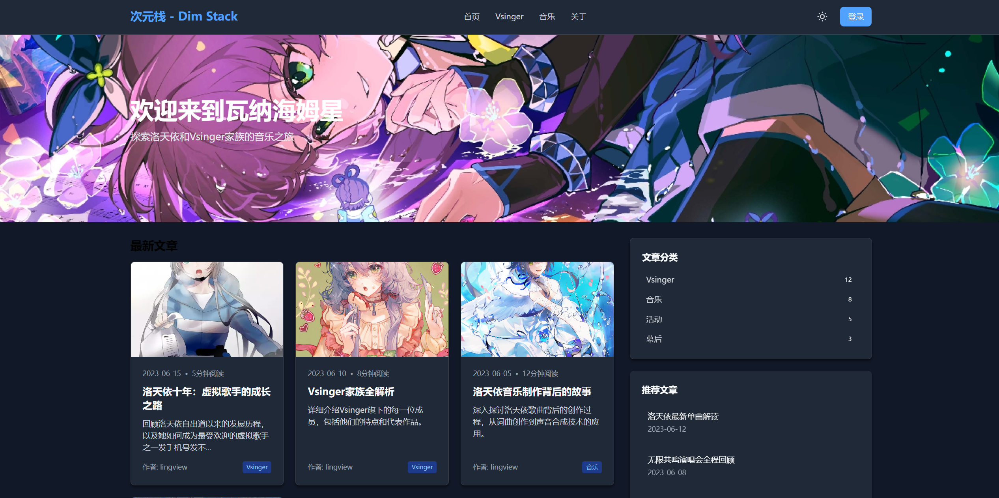
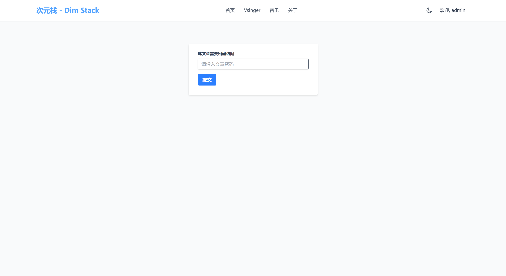
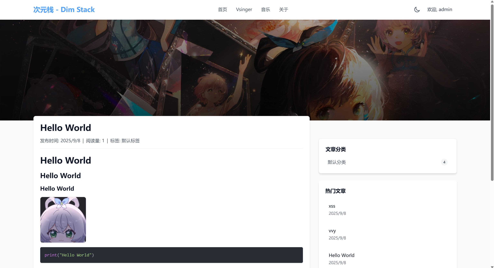

# 次元栈论坛 · Dim Stack
> 基于 Spring Boot + React 的现代化论坛 CMS 系统
>

<!-- 这是一张图片，ocr 内容为： -->


<!-- 这是一张图片，ocr 内容为： -->


<!-- 这是一张图片，ocr 内容为： -->


<!-- 这是一张图片，ocr 内容为： -->


<!-- 这是一张图片，ocr 内容为： -->


---

## 🌟 项目简介
**次元栈** 一个个人练手项目 ps:不要抱太大希望

平台核心功能：

+ 📝 文章发布与内容管理（CMS）
+ 💬 用户互动：评论、点赞、收藏
+ 🔖 标签分类：支持跨圈层内容组织
+ 👥 用户系统：注册、登录、个人主页、权限管理、文章发布管理系统、RBAC权限管理......
+ 🔍 内容搜索与推荐
+ 📱 响应式前端，支持移动端浏览
+ 📦 支持首页、文章页服务端渲染

---

## 🛠 技术栈
| 层级 | 技术选型 |
| --- | --- |
| **后端** | Java 17, Spring Boot 3.5, Mybatis, MySQL, Redis, Cookie |
| **前端** | React 19, JavaScript, Vite, Axios, Tailwind CSS |
| **构建** | Maven (后端), npm/pnpm (前端) |
| **部署** | Docker, Nginx, Linux, Windows |


---

## 半自动部署（推荐）
> 环境要求（给出版本为可用版本，其他版本请自行测试）
>
> OpenJDK版本：17+
>
> Redis版本：5+
>
> mysql版本：8+
>
> 演示站：[https://apilinks.cn/](https://apilinks.cn/)
>

解压下载的压缩包  
然后进入到目录下执行命令：

```bash
java -jar dimstack-1.0-SNAPSHOT.jar
```

运行后找到终端输出的地址（端口号是随机的）在浏览器打开
进入站点初始化界面，格式如下（域名端口改为自己的，在终端或日志中查看）
```bash
http://localhost:8080/init/setup
```

<!-- 这是一张图片，ocr 内容为： -->

<!-- 这是一张图片，ocr 内容为： -->


按照初始化向导的提示填写：管理员用户名、密码、站点运行端口、日志级别、mysql信息以及redis信息等（默认信息不懂的话不要动）

<!-- 这是一张图片，ocr 内容为： -->


填写完后点击确认（系统会自动按照填写的信息完成初始化，导入sql、配置文件生成等），出现下面界面即为成功，重启即可

<!-- 这是一张图片，ocr 内容为： -->


[部署视频](./video/部署教程.mp4)

```
注：如果是如下版本的升级需要手动执行数据库升级脚本（如果数据库不是默认名请将USE dim_stack;修改为对应的数据库名）

v54->v55+
v64->v65+

上述版本请到数据库更新脚本目录中下载对应的升级脚本
注：mysql5的兼容更新脚本只支持到5.7，其他版本请自行处理（建议数据库尽快升级至mysql8+）
```


## 全手动部署
> 环境要求（给出版本为可用版本，其他版本请自行测试）
>
> OpenJDK版本：17+
>
> Redis版本：5+
>
> mysql版本：8+
>
> 演示站：[https://apilinks.cn/](https://apilinks.cn/)
>


### 1、创建配置文件（application.yml）
> 将Mysql以及Redis密码改为自己的，可以适当修改日志级别
>
> 将配置文件放到jar包同级目录下的config文件夹
>

```yaml
spring:
  jackson:
    time-zone: GMT+8
    date-format: yyyy-MM-dd HH:mm:ss

  session:
    redis:
      namespace: "dimstack:session"
      flush-mode: on_save
      save-mode: always

  datasource:
    driver-class-name: com.mysql.cj.jdbc.Driver
    url: jdbc:mysql://localhost:3306/dim_stack?characterEncoding=utf-8&nullCatalogMeansCurrent=true&serverTimezone=GMT%2B8&useSSL=false&allowPublicKeyRetrieval=true&useAffectedRows=true
    username: root
    password: ""
    type: com.alibaba.druid.pool.DruidDataSource

    druid:
      initial-size: 3
      min-idle: 3
      max-active: 20
      max-wait: 60000
      validation-query: SELECT 1
      test-while-idle: true
      test-on-borrow: false
      test-on-return: false


  servlet:
    multipart:
      enabled: true
      max-file-size: 100MB
      max-request-size: 100MB

  data:
    redis:
      host: 127.0.0.1
      port: 6379
      password: ""
      timeout: 5s
      lettuce:
        pool:
          max-active: 8
          max-idle: 8
          min-idle: 0
          max-wait: -1ms

  devtools:
    restart:
      enabled: false
    livereload:
      enabled: false


  thymeleaf:
    cache: true
    enabled: true
    prefix: classpath:/templates/
    suffix: .html
    encoding: UTF-8
    servlet:
      content-type: text/html

  profiles:
    active: dev

springdoc:
  api-docs:
    enabled: true
    path: /v3/api-docs
  swagger-ui:
    enabled: true
    path: /swagger-ui/index.html
    cors:
      enabled: true

project:
  version: ${project.version}
  build-date: ${maven.build.timestamp}

management:
  endpoints:
    enabled-by-default: false
    web:
      exposure:
        include: health,info
  endpoint:
    health:
      enabled: true
      show-details: always
    info:
      enabled: true
    metrics:
      enabled: false
    shutdown:
      enabled: false

mybatis:
  type-aliases-package: xyz.lingview.dimstack.**.domain
  mapper-locations: classpath*:mapper/*Mapper.xml
  config-location: classpath:mybatis-config.xml

server:
  port: 2222
  servlet:
    context-path: /
  tomcat:
    uri-encoding: UTF-8
    max-threads: 200
    min-spare-threads: 10
    protocol-header: X-Forwarded-Proto
    remote-ip-header: X-Forwarded-For


  forward-headers-strategy: native

logging:
  level:
    xyz.lingview.dimstack: info
    org.springframework: warn
    org.springframework.security: info
    org.springframework.session: info
    org.springframework.web: info

file:
  # 文件存储目录
  data-root: .
  upload-dir: upload
  # 日志存储目录
  log-root: .

app:
  theme:
    active-theme: default
    themes-path: themes

```


### 2.创建数据库并导入数据
> 需要手动将dim_stack.sql这个文件导入创建的数据库
>


### 3.安装Redis
下载5+版本的redis双击redis-server启动即可，linux系统无需多言hhh

<!-- 这是一张图片，ocr 内容为： -->


### 4.启动系统
```yaml
java -jar dim_stack.jar
```

## SEO相关
> 文章内容页已支持SSR并且适配主流搜索引擎，使用动态生成的 robots.txt 以及 sitemap.xml
>

### 1. 首页、文章页 SSR
+ 针对搜索引擎 User-Agent 自动返回服务器渲染的 HTML。
+ SSR 页面包含：
  - `<title>`：文章标题
  - `<meta name="description">`：文章摘要
  - `<meta name="keywords">`：文章标签
  - 文章内容和发布时间
  - ......
+ 普通用户访问则返回 SPA 首页，保持 React 的交互体验。
+ 支持主流搜索引擎爬虫：
  - Googlebot、Bingbot、Baiduspider、DuckDuckBot、Sogou、360Spider 等


## 主要界面展示
### 前台
> 白天模式
>

<!-- 这是一张图片，ocr 内容为： -->

<!-- 这是一张图片，ocr 内容为： -->


> 夜晚模式
>

<!-- 这是一张图片，ocr 内容为： -->

<!-- 这是一张图片，ocr 内容为： -->


> 密码文章
>

<!-- 这是一张图片，ocr 内容为： -->

<!-- 这是一张图片，ocr 内容为： -->


> 文章阅读器
>

<!-- 这是一张图片，ocr 内容为： -->

<!-- 这是一张图片，ocr 内容为： -->


> 评论区
>

<!-- 这是一张图片，ocr 内容为： -->


> 文章搜索
<!-- 这是一张图片，ocr 内容为： -->

>

### 后台
> 控制台主页
>
> <!-- 这是一张图片，ocr 内容为： -->

>

> 个人中心
>
> <!-- 这是一张图片，ocr 内容为： -->

>

> 用户管理  
用户权限使用RBAC，可以在此功能区切换用户角色
>

<!-- 这是一张图片，ocr 内容为： -->


> <!-- 这是一张图片，ocr 内容为： -->

>

> 文章管理
>
> <!-- 这是一张图片，ocr 内容为： -->

>
> <!-- 这是一张图片，ocr 内容为： -->

>
> <!-- 这是一张图片，ocr 内容为： -->

>

> 文章审核
>
> <!-- 这是一张图片，ocr 内容为： -->

>
> <!-- 这是一张图片，ocr 内容为： -->

>

> 评论管理
>
> <!-- 这是一张图片，ocr 内容为： -->

>

> 标签&分类管理
>
> <!-- 这是一张图片，ocr 内容为： -->

>
> <!-- 这是一张图片，ocr 内容为： -->

>

> 菜单编辑
>
> <!-- 这是一张图片，ocr 内容为： -->

>

> 站点信息设置
>
> <!-- 这是一张图片，ocr 内容为： -->

>

> 主题设置
>
> <!-- 这是一张图片，ocr 内容为： -->

>


## 致谢
在此，我们衷心感谢以下为本项目提供帮助、支持或灵感的个人和组织：

### 贡献者
感谢所有参与本项目的贡献者（按字母顺序排列）：

+ [@bytegeek](https://github.com/xrb114) - 渗透测试
+ [@lingview](https://github.com/lingview) - 系统开发
+ [@q1uf3ng](https://github.com/q1uf3ng) - 渗透测试


---

### 💡 特别感谢
+ 感谢所有为本项目贡献代码、提出问题和提供反馈的开发者。
+ 感谢开源社区持续的支持与贡献。

---

如果你在本项目中做出了贡献，请提交 PR 将你的名字加入到致谢名单中！

