# 次元栈 · Dim Stack
> 基于 Spring Boot + React 的现代化个人博客系统
>


---

## 🌟 项目简介
**官方qq群** ：577040366

**次元栈** 基于SpringBoot4的全新博客系统

平台核心功能：

+ 📝 文章内容管理（CMS）
+ 💬 用户互动：评论、点赞
+ 🔖 标签分类：支持跨圈层内容组织
+ 👥 用户系统：个人主页、文章发布管理系统、完整RBAC权限系统......
+ 📱 响应式前端，支持移动端浏览
+ 📦 支持首页、文章页服务端渲染
+ ......

---

## 🛠 技术栈
| 层级 | 技术选型 |
| --- | --- |
| **后端** | Java 17+，Spring Boot 4，MySQL5.7+，Redis |
| **前端** | React 19，Vite，Tailwind CSS v4 |
| **构建** | Maven (后端)，npm(前端) |
| **部署** | Docker，Linux，Windows |


---

## 宝塔面板部署
请移步b站查看部署视频

[https://www.bilibili.com/video/BV1qncgzkEHk/](https://www.bilibili.com/video/BV1qncgzkEHk/)


## Linux部署
> 环境要求（给出版本为可用版本，其他版本请自行测试）
>
> OpenJDK版本：17+
>
> Redis版本：5+（可选）
>
> mysql版本：5.7+
>
> 演示站：[https://apilinks.cn/](https://apilinks.cn/)
>


### 初始化
解压下载的压缩包  
然后进入到目录下执行命令：

注："--server.port=2223"选项为可选（用于强制指定服务运行端口）

```bash
java -jar dimstack-1.0-SNAPSHOT.jar --server.port=2223
```

运行后找到终端输出的地址（如不指定--server.port=2223端口号是随机的）在浏览器打开  
进入站点初始化界面，格式如下（域名端口改为自己的，在终端或日志中查看）

```bash
http://localhost:2223/init/setup
```

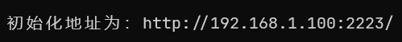


按照初始化向导的提示填写：管理员用户名、密码、站点运行端口、日志级别、mysql信息以及redis信息等（默认信息不懂的话不要动）

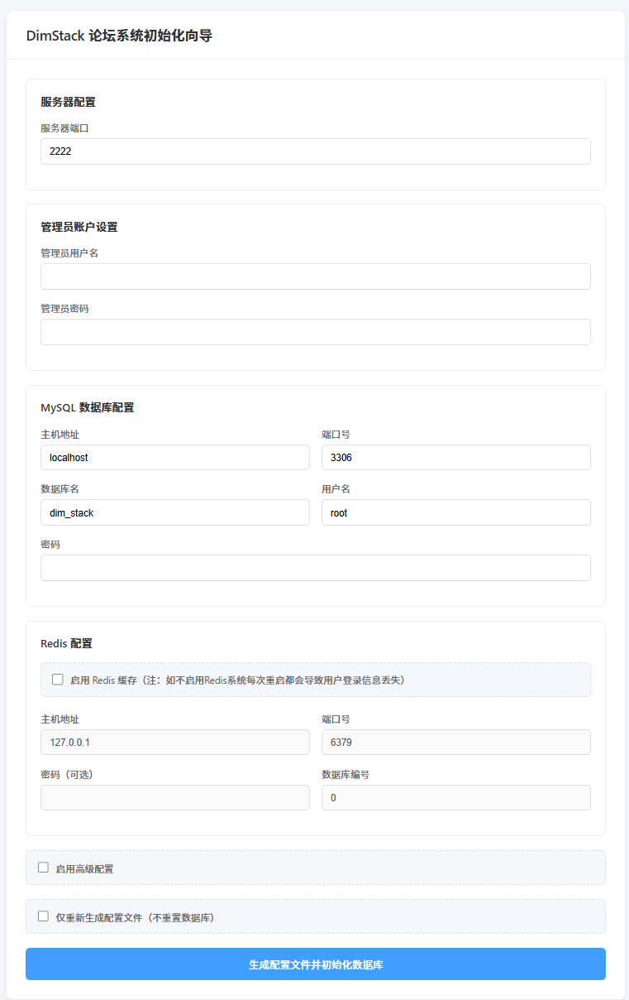

填写完后点击确认（系统会自动按照填写的信息完成初始化，导入sql、配置文件生成等），出现下面界面即为成功，重启即可

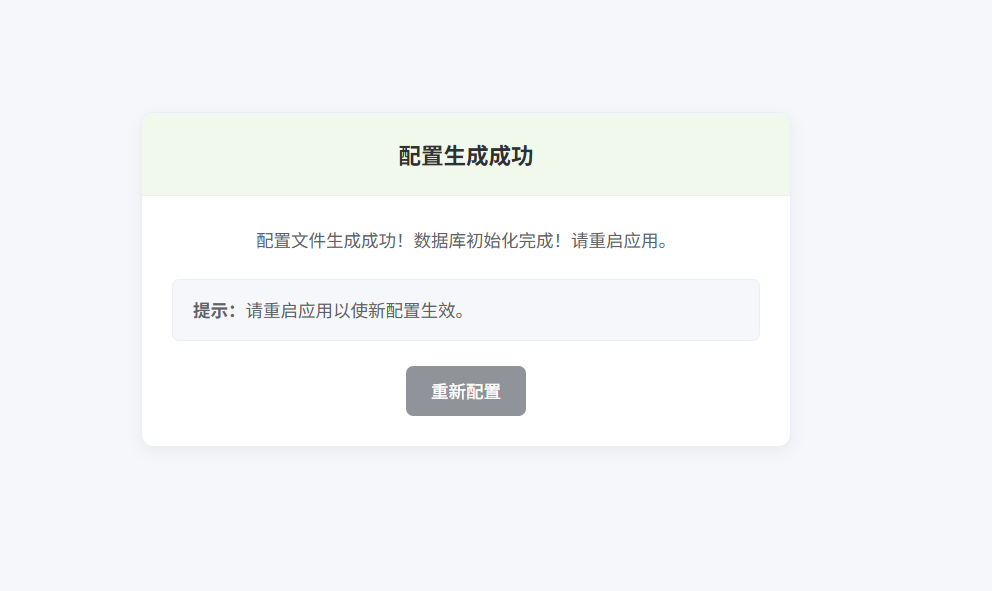


### 启动测试
再次运行系统

```bash
java -jar dimstack-1.0-SNAPSHOT.jar
```

运行后能看到主页正常加载即为成功

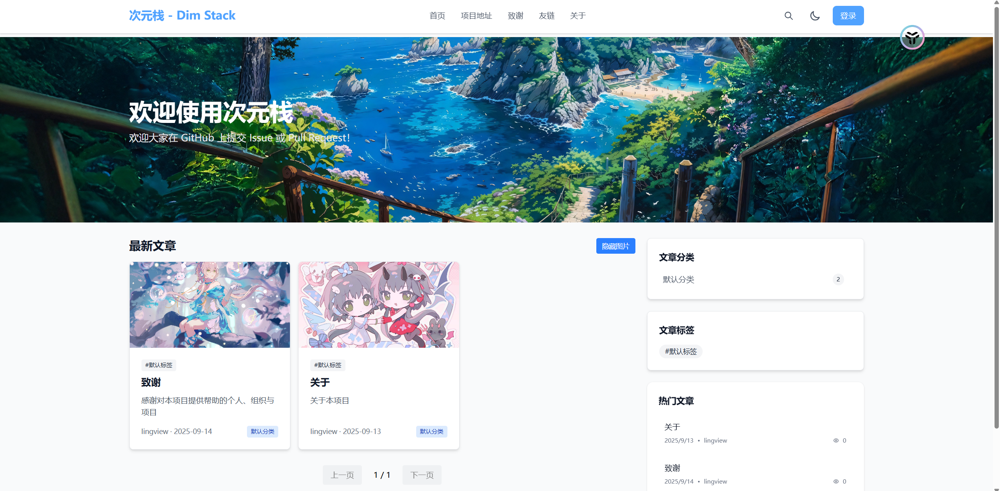

### systemd自启
#### 创建服务文件
```bash
sudo vim /etc/systemd/system/dimstack.service
```

#### 写入下面内容（请根据自己服务器情况修改）
```bash
[Unit]
Description=Dim Stack Forum Backend Service
After=network.target mysql.service redis.service
Wants=mysql.service redis.service

[Service]
Type=simple
User=root
Group=root
WorkingDirectory=/root/dimstack

Environment="JAVA_OPTS=-server -Xms512m -Xmx1g -XX:+UseG1GC -XX:+UseStringDeduplication -Dfile.encoding=UTF-8"

ExecStart=/bin/sh -c 'exec java $JAVA_OPTS -jar dimstack-1.0-SNAPSHOT.jar'

SuccessExitStatus=143

Restart=always
RestartSec=15

StartLimitInterval=600s
StartLimitBurst=5

ProtectSystem=full
# 如果需要访问用户目录下的文件，请改为"ProtectHome=false"
ProtectHome=true
PrivateTmp=true
PrivateDevices=true
NoNewPrivileges=true
RestrictSUIDSGID=true   
RestrictAddressFamilies=AF_UNIX AF_INET AF_INET6

OOMPolicy=continue
LimitNOFILE=65535

StandardOutput=journal
StandardError=journal
SyslogIdentifier=dim_stack

[Install]
WantedBy=multi-user.target
```

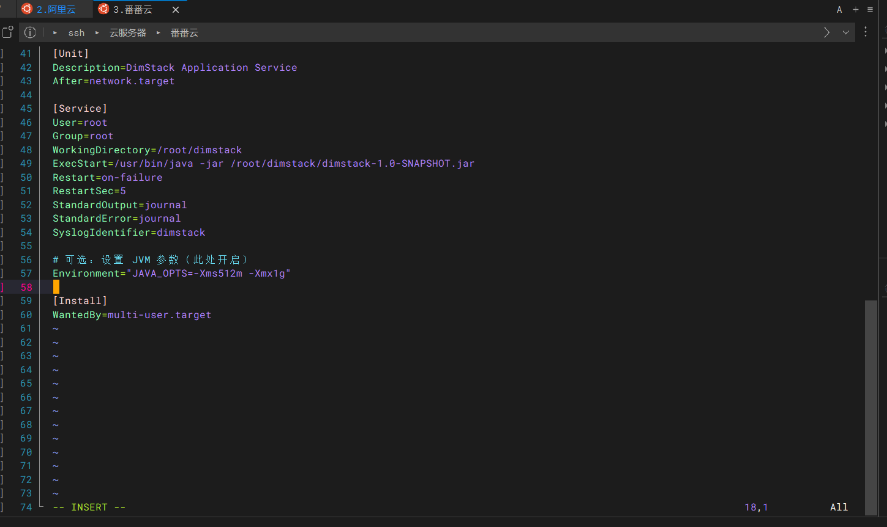

#### 重载systemd配置
```bash
systemctl daemon-reload 
```

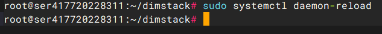

#### 启动服务
```bash
sudo systemctl start dimstack
```

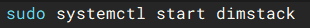

#### 检查状态
```bash
sudo systemctl status dimstack
```

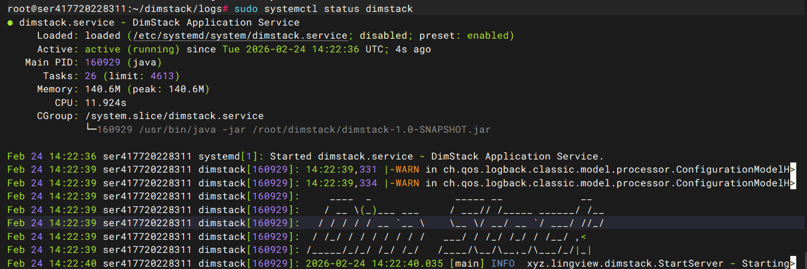

#### 设置开机自启
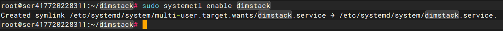

## 老版本相关
注：v84以下的版本没有一键更新系统，所以需要手动完整数据库更新

### 数据库迁移（新版v84+请忽略）
```plain
注：如果是如下版本的升级需要手动执行数据库升级脚本（如果数据库不是默认名请将USE dim_stack;修改为对应的数据库名）
v54->v55+
v64->v65+
v77->v84+
上述版本请到数据库更新脚本目录中下载对应的升级脚本
注：mysql5的兼容更新脚本只支持到5.7，其他版本请自行处理（建议数据库尽快升级至mysql8+）（v82+版本已逐步放弃mysql5.x支持，所以mysql5版本的系统请不要升级）
```

## 大模型相关功能
> 次元栈目前已支持大模型文章内容审核以及文章内容生成
>

### 大模型配置&使用

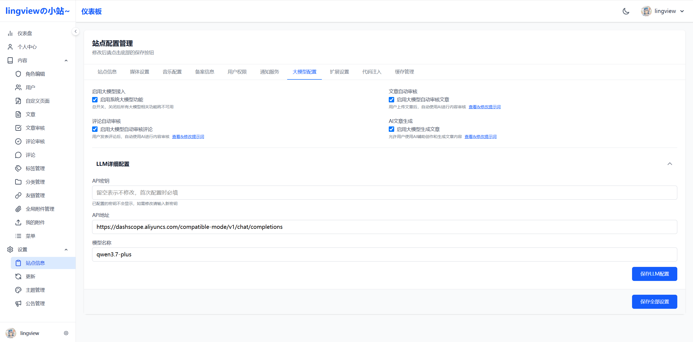

#### 文章审核模块的默认提示词（请谨慎修改提示词）
大模型审核开启后，所有新发布的文章都会优先进行大模型分析，如果审核通过将直接发布，审核违规将直接违规不会通知管理员审核（如果文章作者认为模型判断有误可以自行联系管理员），如果是系统调用出现问题会自动降级到通知有审核权限人员对文章进行审核

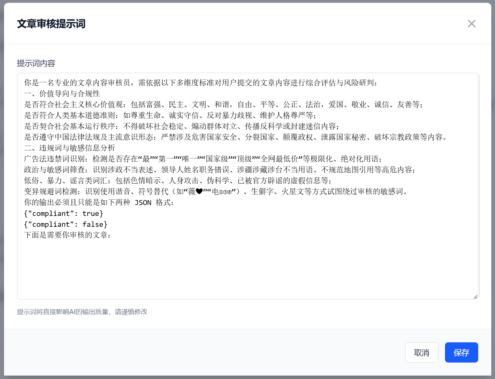

#### 文章生成默认提示词（请谨慎修改提示词）
文章生成模块开启后用户可以在文章编辑器快捷调用大模型生成文章


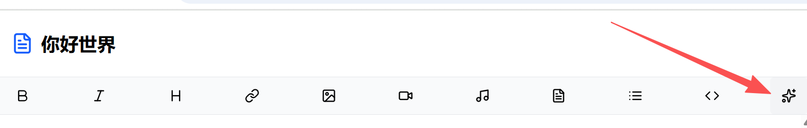

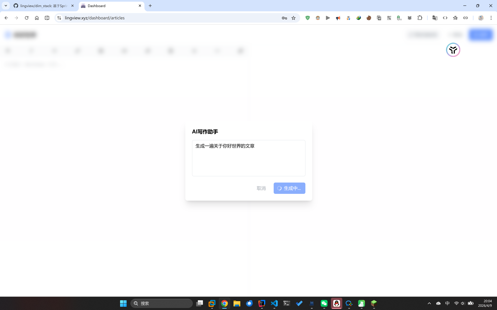

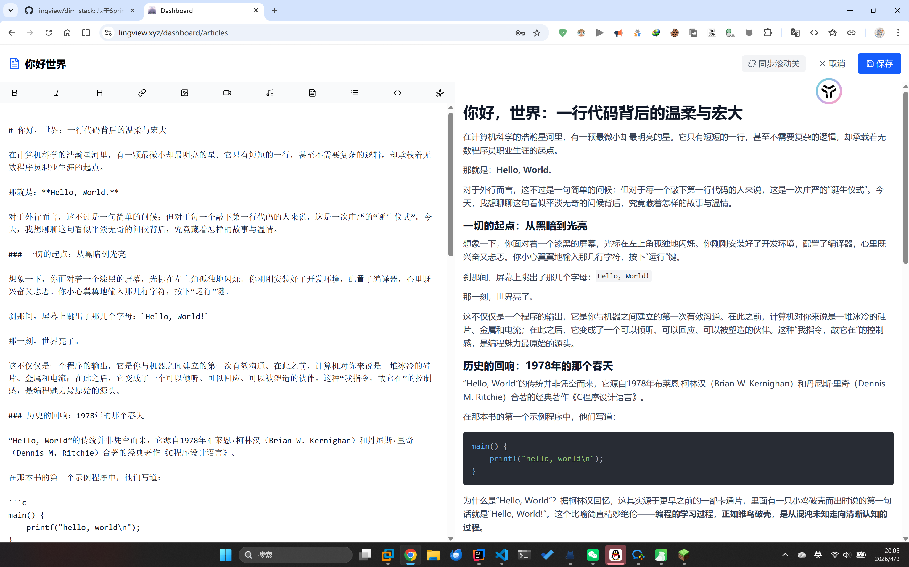


## 智能图片压缩
> 系统提供图片智能压缩功能，可以在系统配置中开启
>

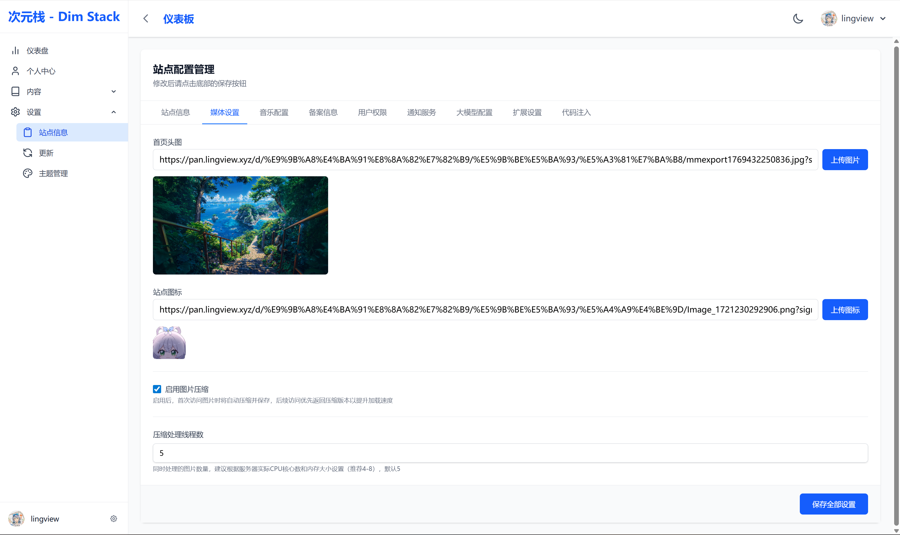

### 压缩规则
注：对于小于1MB的jpg/png图片会跳过压缩，webp图片也不会压缩（因为足够小）

#### JPEG 图片：
+ ≤ 2MB → 质量 0.55
+ ≤ 5MB → 质量 0.45
+ 5MB → 质量 0.35

#### 其他格式（转 JPEG）：
+ ≤ 500KB → 质量 0.7
+ ≤ 2MB → 质量 0.6
+ ≤ 5MB → 质量 0.5
+ 5MB → 质量 0.4

### 处理策略
图片会在第一次加载预览的时候进行压缩，正常情况下在编辑器上传后就会进入压缩队列（老版本升级后会在图片第一次被访问时加入压缩队列）

如果需要获取原图需要在图片url后面加入?download=true，例如：

```plain
https://apilinks.cn/file/5561656e3db242a6bf342714f08855ab?download=true
```

为了方便操作系统也在文章阅读器的图片查看功能中添加了**下载原图**功能：

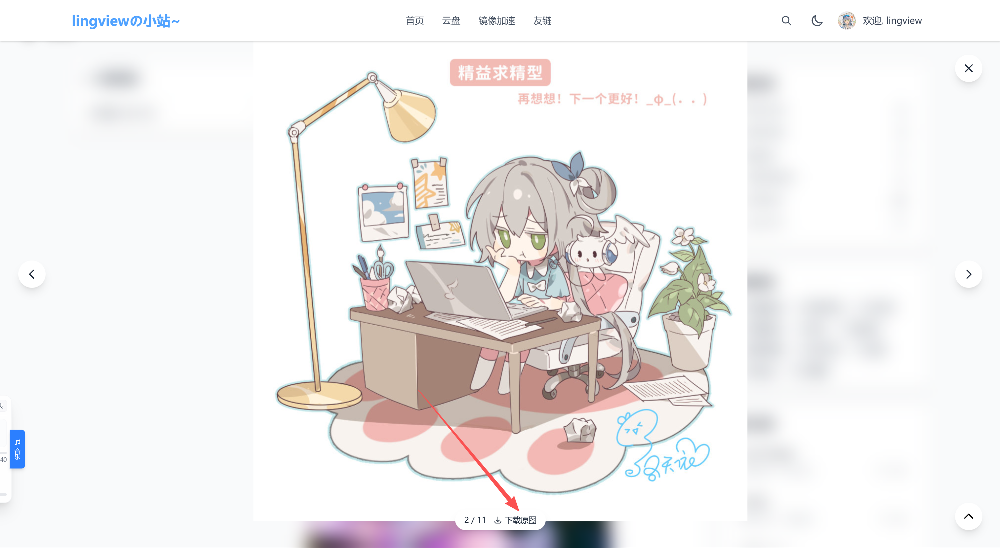

## 外部资源本地化
> 系统支持导入其他博客或笔记软件文章的功能，并且可以将文章内的图片、视频外链转化为本地
> 

### 安全防护规则
系统实施了严格的IP来源分类与访问控制策略：来自localhost（包括127.0.0.1、localhost）的请求可访问所有地址（含localhost、内网和公网）；而非localhost请求（如局域网客户端）则禁止访问服务器自身的localhost或127.x.x.x地址，以防止对本地服务的探测。对于公网请求（即客户端IP不属于任何私有网段），系统进一步限制其不得访问任何私有IP地址（如10.x.x.x、172.16–31.x.x、192.168.x.x、169.254.x.x等），仅允许访问公网地址。在域名检测方面，系统将localhost、127.0.0.1、任意*.localhost子域、127.x.x.x网段，以及DNS解析结果为回环地址的域名均视为本地回环资源。为防范DNS重绑定攻击，系统在建立HTTP连接前会重新解析域名，并验证所得IP是否符合上述安全策略，从而阻止攻击者通过动态DNS将域名指向内网地址。此外，系统仅支持HTTP和HTTPS协议，明确拒绝ftp、file等其他协议。真实客户端IP的获取依赖于Spring Boot的server.forward-headers-strategy: native配置，自动从X-Forwarded-For等标准代理头中提取原始IP，无需手动解析HTTP头信息。

### 功能说明
使用此功能需要在站点配置中开启（默认关闭）

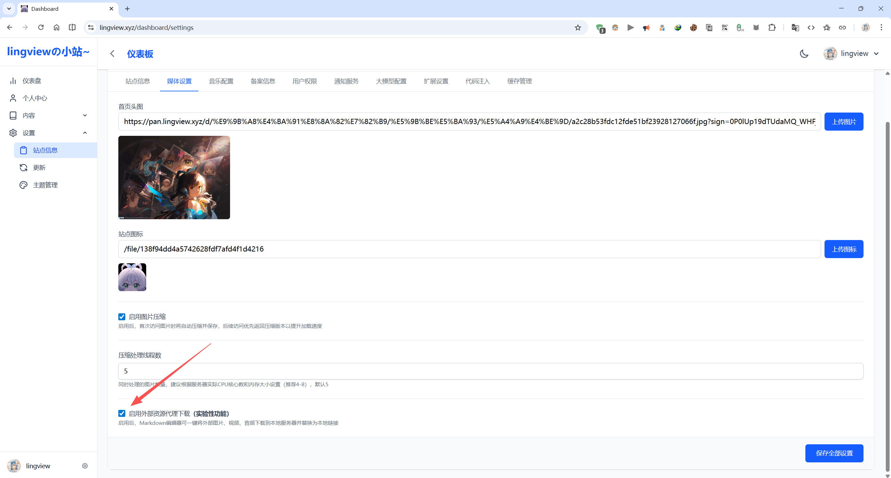

点击快捷工具栏中的下载图标即可打开本功能操作页面

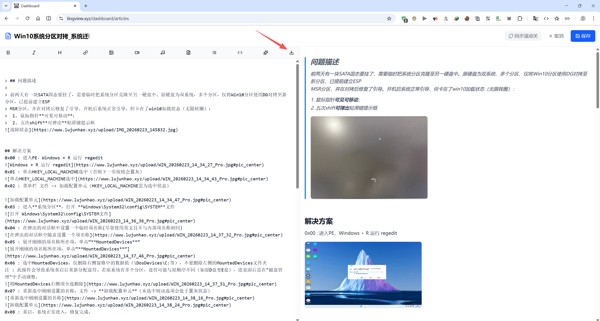

一般来说直接点击“全部本地化”即可

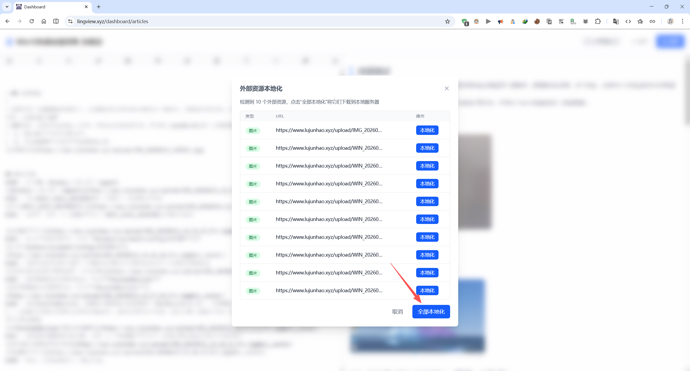

后台操作完后会自动关闭对话框，并且可以看到已经转化为内部链接了

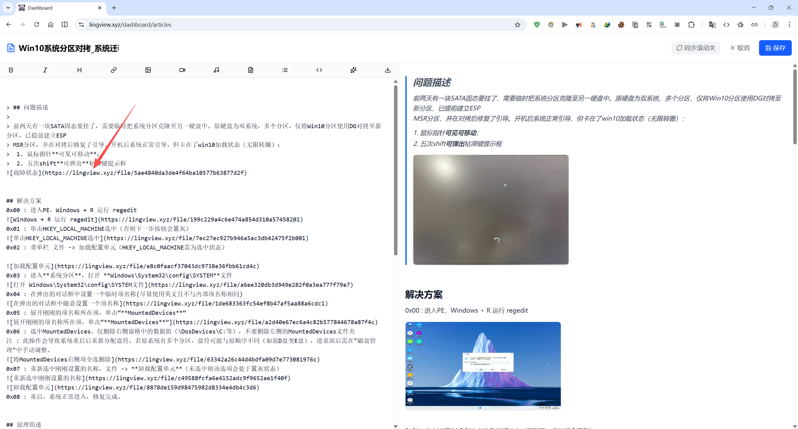

注：本项目外部资源本地化功能默认关闭，使用者请勿将本项目部署至香港及境外服务器后开启资源本地化功能，严禁利用本功能爬取、存储、传播色情、暴力、赌博、涉政等任何违法违规内容，任何个人或组织私自部署、修改、滥用本功能所产生的一切法律责任，均由使用者自行承担，与项目作者无关

## 代码注入相关
> 系统提供自定义全局head、内容页head以及页脚自定义
>

注：请务必检查注入的代码是否安全，尽量不要引入外部链接，注意防范XSS、CSRF等常见攻击手段

### 功能说明
全局head以及页脚自定义在除了后台的所有页面生效，内容页head自定义只有在文章页生效


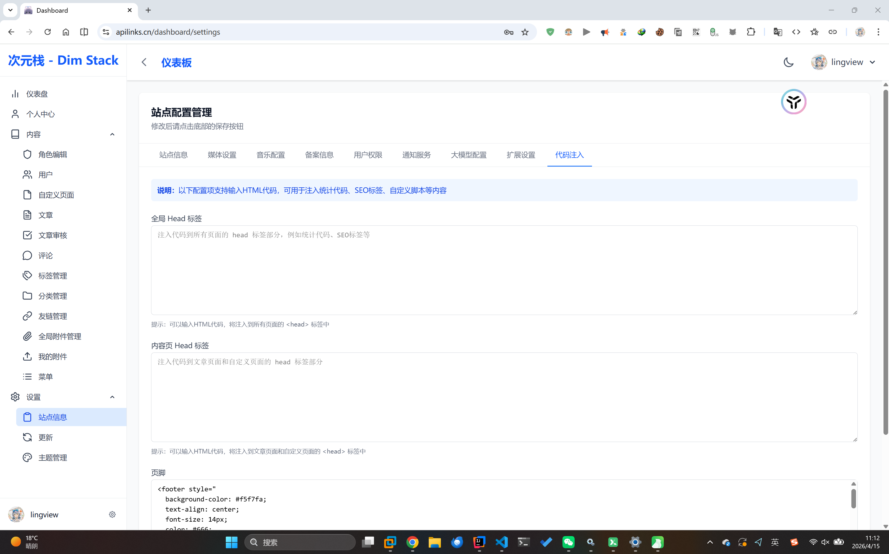

## SEO相关
> 文章内容页已支持SSR并且适配主流搜索引擎，使用动态生成的 robots.txt 以及 sitemap.xml
>

### 首页、文章页 SSR
+ 针对搜索引擎 User-Agent 自动返回服务器渲染的 HTML。
+ SSR 页面包含：
  - `<title>`：文章标题
  - `<meta name="description">`：文章摘要
  - `<meta name="keywords">`：文章标签
  - 文章内容和发布时间
  - ......
+ 普通用户访问则返回 SPA 首页，保持 React 的交互体验。
+ 支持主流搜索引擎爬虫：
  - Googlebot、Bingbot、Baiduspider、DuckDuckBot、Sogou、360Spider 等

### SEO优化
支持动态生成 Sitemap 和 Robots.txt，智能处理反向代理头

针对Google、Bing等主流搜索引擎的爬虫进行了独立优化（未覆盖百度，百度爬虫仅能获取基础信息）

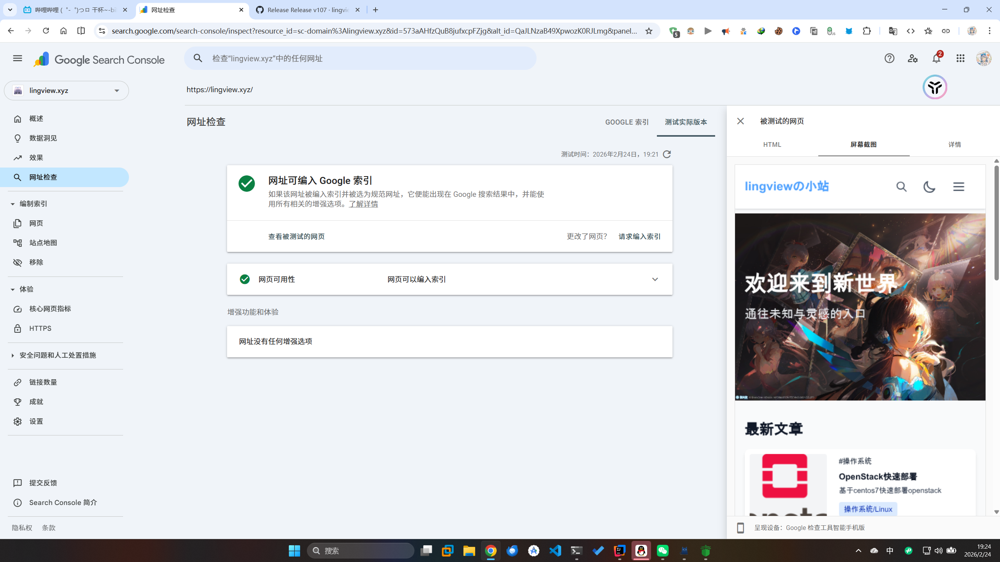

### 大模型读取
文章内容可以被大部分网页AI直接读取（密码文章无法读取）

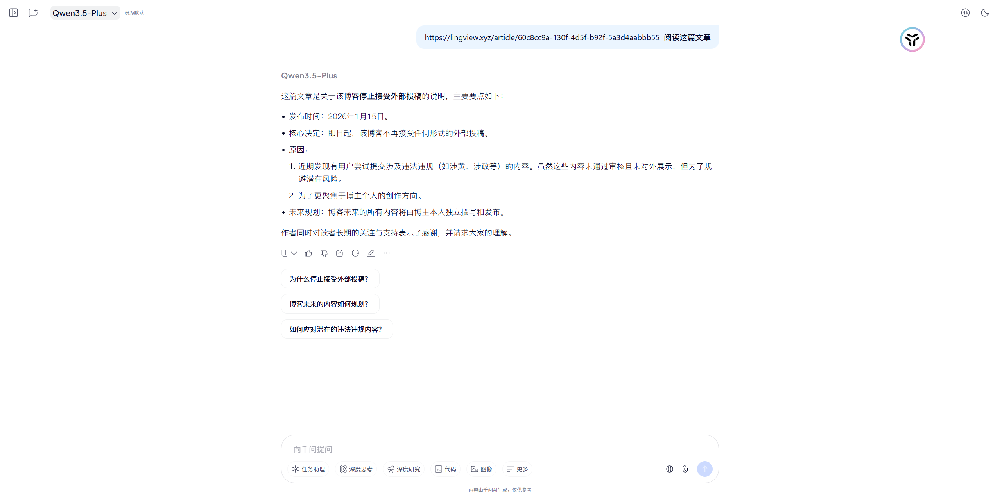


## 系统启动相关
### 流程图



## 缓存模式相关
### 流程图


## 贡献者
感谢所有参与本项目的贡献者（按字母顺序排列）：

+ [@bytegeek](https://github.com/xrb114) - 渗透测试
+ [@dear-sk](https://github.com/dear-sk) - 系统测试
+ [@Denghls](https://github.com/Denghls) - 需求分析
+ [@hanbingniao](https://github.com/hanbingniao) - 系统测试
+ [@kongcangyimama](https://github.com/kongcangyimama) - 主题设计
+ [@lingview](https://github.com/lingview) - 系统开发
+ [@q1uf3ng](https://github.com/q1uf3ng) - 渗透测试
+ [@YeFeng0712](https://github.com/YeFeng0712) - 需求分析
+ [@yukifia](https://github.com/yukifia) - 需求分析


---

### 💡 特别感谢
+ 感谢所有为本项目贡献代码、提出问题和提供反馈的开发者。
+ 感谢开源社区持续的支持与贡献。

---

如果你在本项目中做出了贡献，请提交 PR 将你的名字加入到致谢名单中！

