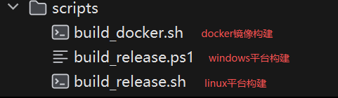

# 部署教程

## 环境要求

- **JDK**: 17+（推荐 21+ 以支持虚拟线程）
- **MySQL**: 5.7+
- **Redis**: 5+（可选）
- **Node.js**: 22+

演示站：[https://apilinks.cn/](https://apilinks.cn/)

---

## 宝塔面板部署

请移步 B 站查看详细部署视频：

[https://www.bilibili.com/video/BV1qncgzkEHk/](https://www.bilibili.com/video/BV1qncgzkEHk/)

---

## Linux 手动部署

### 1. 初始化

解压下载的压缩包，进入目录下执行：

```bash
java -jar dimstack-1.0-SNAPSHOT.jar --server.port=2223
```

> `--server.port=2223` 为可选参数，用于指定运行端口

运行后找到终端输出的地址，在浏览器打开初始化页面：

```
http://localhost:2223/init/setup
```

按照向导填写管理员用户名、密码、站点端口、日志级别、MySQL 及 Redis 信息，点击确认后系统会自动完成初始化。


填写完成后点击确认，出现以下界面即为成功：


### 2. 启动测试

初始化完成后重启服务：

```bash
java -jar dimstack-1.0-SNAPSHOT.jar
```

看到主页正常加载即为成功：


---

## Docker 部署

项目提供 Docker 一键部署脚本，支持自动检测首次运行并完成初始化。

```bash
# 赋予执行权限
chmod +x docker-run.sh

# 启动服务（默认端口 2222）
./docker-run.sh

# 自定义端口（宿主机端口:容器端口）
./docker-run.sh 8080 2222
```

> 新手推荐使用上面的原生部署方式，Docker 部署对新手并不友好。

---

## systemd 开机自启（Linux）

> 使用宝塔面板等运维工具部署的可忽略此节。

### 1. 创建服务文件

```bash
sudo vim /etc/systemd/system/dimstack.service
```

### 2. 写入配置

```ini
[Unit]
Description=Dim Stack Forum Backend Service
After=network.target mysql.service redis.service
Wants=mysql.service redis.service

[Service]
Type=simple
User=root
Group=root
WorkingDirectory=/root/dimstack

Environment="JAVA_OPTS=-server -Xms512m -Xmx1g -XX:+UseG1GC -XX:+UseStringDeduplication -Dfile.encoding=UTF-8"

ExecStart=/bin/sh -c 'exec java $JAVA_OPTS -jar dimstack-1.0-SNAPSHOT.jar'

SuccessExitStatus=143

Restart=always
RestartSec=15

StartLimitInterval=600s
StartLimitBurst=5

ProtectSystem=full
ProtectHome=false
PrivateTmp=true
PrivateDevices=true
NoNewPrivileges=true
RestrictSUIDSGID=true
RestrictAddressFamilies=AF_UNIX AF_INET AF_INET6

OOMPolicy=continue
LimitNOFILE=65535

StandardOutput=journal
StandardError=journal
SyslogIdentifier=dim_stack

[Install]
WantedBy=multi-user.target
```

> 请根据实际服务器情况修改 `WorkingDirectory`、`User` 等配置。


### 3. 重载 systemd 配置

```bash
sudo systemctl daemon-reload
```


### 4. 启动并检查状态

```bash
sudo systemctl start dimstack
```


```bash
sudo systemctl status dimstack
```


### 5. 设置开机自启

```bash
sudo systemctl enable dimstack
```


---

## 构建脚本

项目提供跨平台构建脚本，支持一键完成前后端构建与打包。

> 需要将 `scripts` 目录下的构建脚本复制到项目根目录执行。



### 环境要求

- Java 17+（推荐 21+）
- Maven
- Node.js 22+
- npm

### Linux

```bash
# 赋予执行权限
chmod +x build_release.sh

# 执行构建
./build_release.sh
```

### Windows

以管理员身份运行 PowerShell：

```powershell
# 设置执行策略（首次运行需要）
Set-ExecutionPolicy -ExecutionPolicy RemoteSigned -Scope CurrentUser

# 执行构建脚本
.\build_release.ps1
```

构建完成后，jar 包将位于项目根目录。
