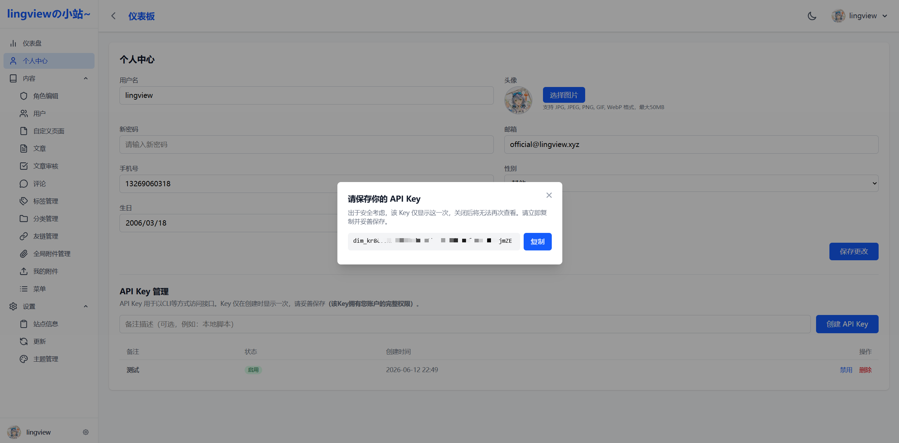
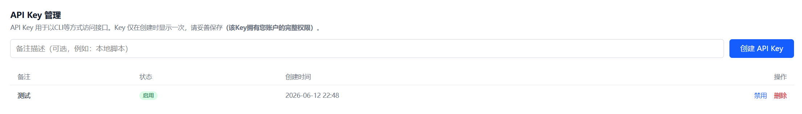

# 访问控制Key

除了cookie的认证方式系统还提供key认证功能 **注：key的权限和对应用户权限一致**





## 使用实例

只需要在请求的头部加上Key即可，下面以创建文章接口为例

```bash
POST {Base_URL}/api/uploadarticle
Authorization: Bearer {Key}
Content-Type: application/json
```

注：该功能为后续Agent维护功能做准备，目前已实现QwenCode调用接口创建文章（该skill会在充分测试后放出），文章url：https://lingview.xyz/article/cf096b18-bbfb-468c-a8ec-2dc84f8649f5