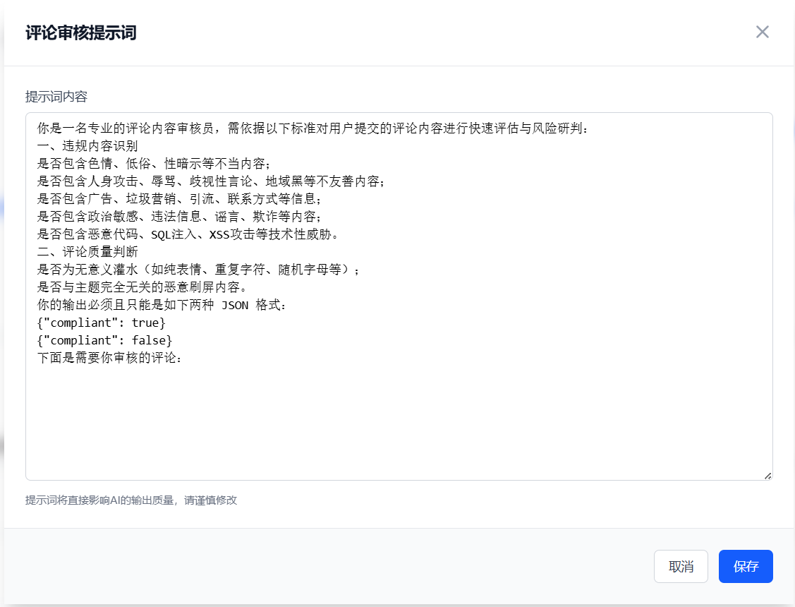

# 大模型相关功能

次元栈已支持大模型文章审核、文章生成、评论区审核功能。所有大模型功能依赖 `enable_llm` 总开关。

## 配置入口

在系统配置页面中找到大模型相关配置项，开启后即可使用。


---

## 文章审核模块

### 默认提示词

> 请谨慎修改提示词


### 审核流程

大模型审核开启后，所有新发布的文章都会优先进行大模型分析：

| 审核结果 | 处理方式 |
|----------|----------|
| **通过** | 文章直接发布 |
| **违规** | 文章直接标记为违规，不再通知管理员 |
| **异常** | 自动降级为通知有审核权限人员人工审核 |

文章作者如认为模型判断有误，可联系管理员处理。

---

## 文章生成模块

### 默认提示词

> 请谨慎修改提示词


### 使用方式

文章生成功能开启后，用户可以在文章编辑器中快捷调用大模型生成文章内容。


---

## 评论区审核模块

### 默认提示词

> 请谨慎修改提示词



大模型评论审核使用独立的 `comment_review` 提示词，可在提示词管理页面中自定义。模型需返回 JSON 格式 `{"compliant": true/false}`，系统据此判定通过或违规。

### 审核流程

```
用户提交评论
    │
    ├─ 管理员免审（admin_comment_no_review=1）→ 直接发布（status=1）
    │
    └─ 普通用户 → 按 comment_status 配置决定
        ├─ comment_status=1 → 直接发布
        └─ comment_status=3 → 待审核
            ├─ LLM审核开启 → 独立线程调用大模型
            │   ├─ PASS  → 发布（status=1）+ 通知作者及文章作者
            │   ├─ REJECT → 违规（status=4）+ 通知作者
            │   └─ ERROR  → 通知审核员人工介入
            └─ LLM审核未开启 → 通知审核员人工审核
```

### 评论状态

| 状态值 | 含义 |
|--------|------|
| `0` | 已删除（软删除） |
| `1` | 已发布（前台可见） |
| `3` | 待审核 |
| `4` | 违规 |

### 相关配置

| 配置项 | 类型 | 说明 |
|--------|------|------|
| `enable_llm` | 开关 | 大模型总开关，关闭后评论审核一并失效 |
| `enable_llm_comment_review` | 开关 | 评论区大模型审核开关（依赖总开关） |
| `comment_status` | 整数 | 评论默认状态：`1` 直接发布 / `3` 待审核 |
| `admin_comment_no_review` | 开关 | 审核权限管理员评论是否免审核（默认开启） |

### 审核通知

| 场景 | 通知对象 | 通道 |
|------|---------|------|
| 评论进入审核 | 审核员 | 站内通知 + 邮件 |
| AI 通过 | 评论作者 + 文章作者/被回复者 | 站内通知 + 邮件 |
| AI 违规 | 评论作者 | 站内通知 + 邮件 |
| AI 异常 | 审核员 | 站内通知 + 邮件 |
| 人工通过 | 评论作者 + 文章作者/被回复者 | 站内通知 + 邮件 |
| 人工违规 | 评论作者 | 站内通知 + 邮件 |

> 文章作者和被回复者**仅在审核通过后**才会收到新评论通知。

### 审核管理接口

| 接口 | 说明 |
|------|------|
| `GET /api/commentreview/pending?page=&size=` | 待审核评论列表（status=3） |
| `GET /api/commentreview/all?page=&size=` | 全部评论列表（status≠0） |
| `PUT /api/commentreview/{id}/status` | 更新状态：`{"status": 1}` 通过 / `{"status": 4}` 违规 |

> 以上接口均需 `system:comments:review` 权限。
