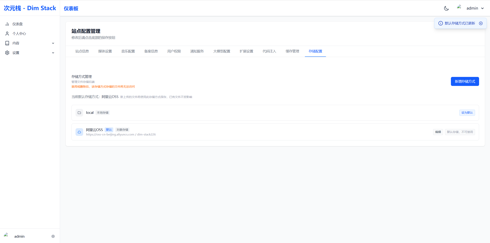

# 外置存储

系统支持将附件存储到外部存储服务，当前支持 S3 协议兼容的对象存储（阿里云 OSS、腾讯云 COS 等）

## 启用方式

在站点配置的**存储配置**标签页中添加存储方式，并设为默认

## 存储管理

### 禁用与启用

- 禁用后，该存储方式下的文件将无法访问，上传也会失败
- 禁用前需先切换默认存储方式
- 启用后恢复正常访问

### 删除

- 删除存储方式后不会清除存储桶内数据
- 删除前需先切换默认存储方式
- 删除后，该存储方式下的文件记录仍保留在数据库中，但无法访问

## 附件存储迁移

在全局附件管理中，点击「存储迁移」按钮，可将附件从一个存储方式迁移到另一个。

### 迁移流程

1. 选择源存储（被迁移）和目标存储（迁移到）
2. 点击「执行迁移」
3. 系统逐条处理：从源存储读取 -> 写入目标存储 -> 删除源存储旧文件 -> 更新数据库记录
4. 迁移完成后显示结果（成功数 / 失败数）

### 失败重试

- 迁移失败的附件会列出失败原因
- 点击「重试失败项」可对失败附件重新迁移
- 源文件不存在的附件会自动跳过，不计入失败

### 注意事项

- 源存储和目标存储必须都是启用状态，且不能相同
- 迁移过程中文件访问不受影响（仍在源存储）
- 迁移成功后源存储的旧文件会被自动删除
- 删除源文件失败不影响迁移结果

## 文件访问

S3 存储的文件通过 Presigned URL（预签名 URL）访问：

- 用户请求 `/file/{accessKey}` 时，后端生成临时有效的预签名 URL
- 浏览器通过 302 重定向直接从对象存储下载文件
- 预览链接有效期 1 小时，下载链接有效期 5 分钟
